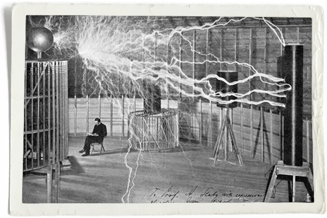
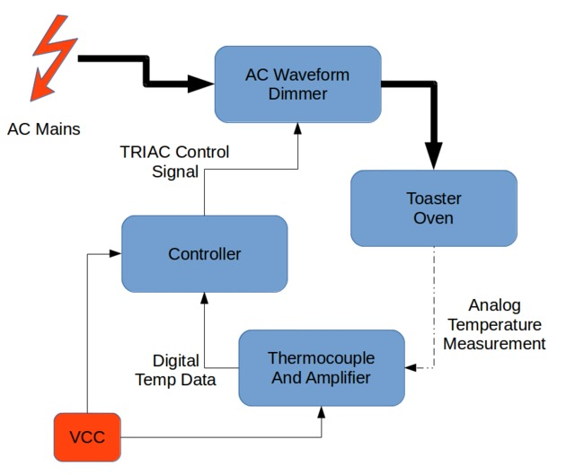
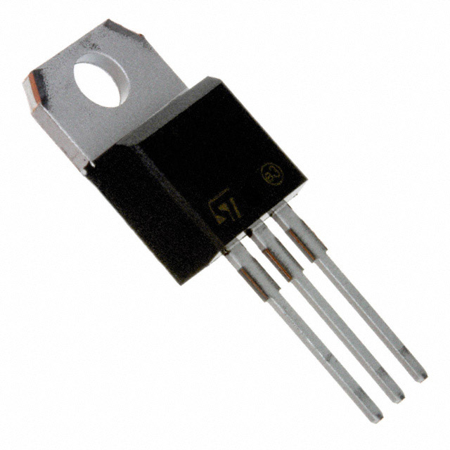
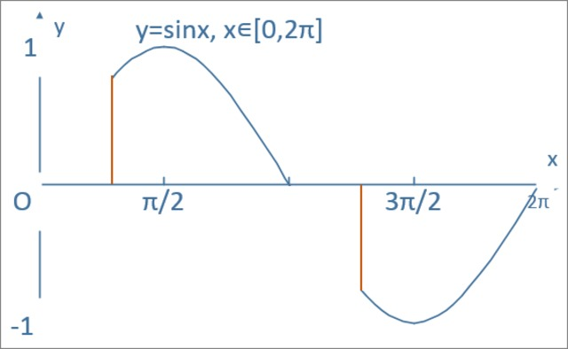
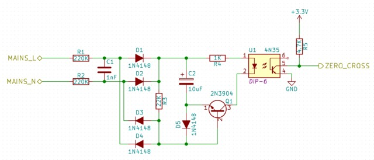
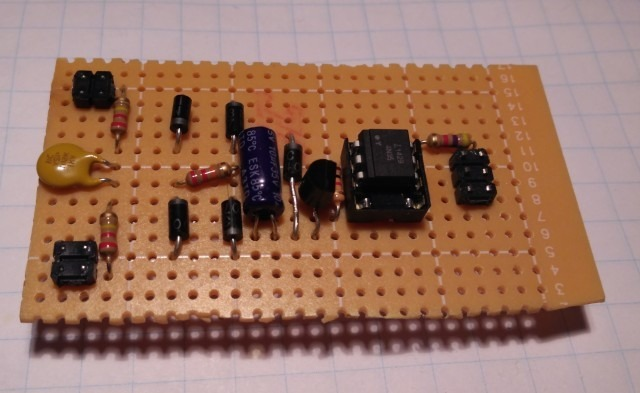
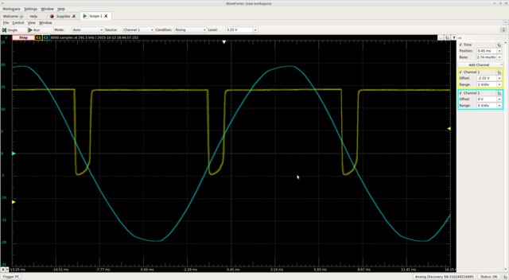
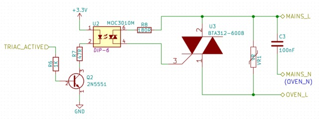
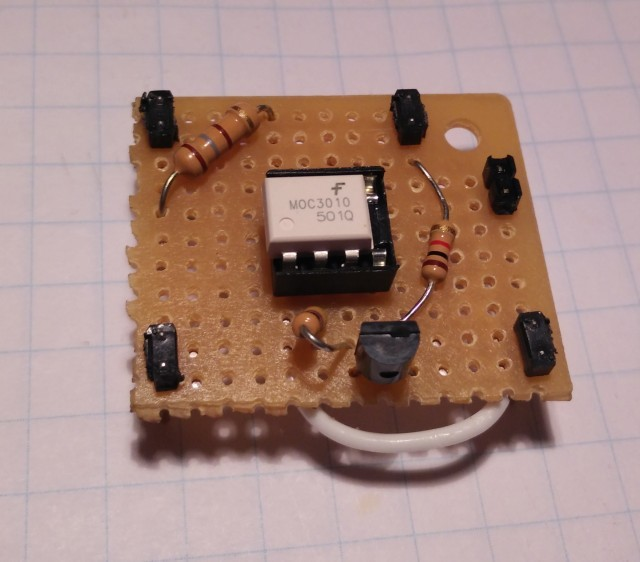
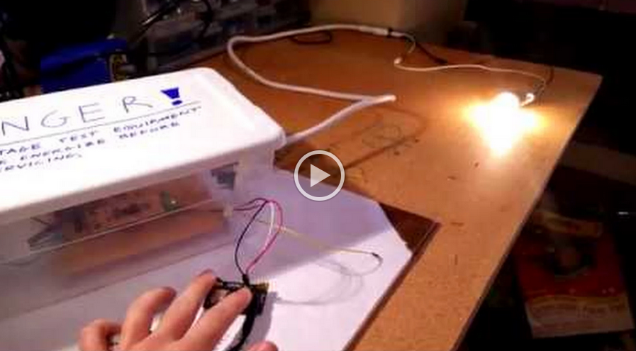

# Controlling AC Mains with a Microcontroller for Fun and Profit
#### By [Patrick Lloyd](http://www.allaboutcircuits.com/author/patrick-lloyd)

## Summary
The first part of several on how to put together your own toaster oven controller with a handful of inexpensive, through-hole parts. The emphasis is on safety, low price, and minimal modification of the toaster oven. All project files and documentation can be found on [my repository on GitHub](https://github.com/swedishhat/iot-reflow-oven/). Feel free to contribute.

## Technical Concepts
* High-voltage circuits
* TRIAC control
* Zero-crossing detectors
* Phase manipulation

## Introduction
The world is getting smaller and so are electronics designs. Through-hole components are less profitable for parts manufacturers and as a result, new products are often times only available in surface mount packages. Being able to solder surface mount parts by hand is a very valuable skill and can come in handy for parts like chip resistors and caps, small outline packages (SOIC/TSSOP), and quad flat packages (QFP). Still, what if the perfect ARM core for your quadcopter controller only comes as a quad-flat no-leads (QFN)? What if that FPGA you need to do vision processing with is only in a ball-grid array (BGA) style? You can take your chances with a hot air gun or you can use a solder reflow oven.

_Oooh shiny... But at what cost!?_

Solder reflow ovens are nothing new, nor is making one for yourself out of a standard toaster like this one. The issue is that commercial options are generally very expensive (the one above may cost upwards of $2000 USD) and many home-built options often require the dismantling and modding the toaster which can be error prone and require special tools (my own [Black & Decker Toasr-R-Oven](http://www.amazon.com/gp/product/B00FN3MV88/ref=pd_lpo_sbs_dp_ss_1?pf_rd_p=1944687742&pf_rd_s=lpo-top-stripe-1&pf_rd_t=201&pf_rd_i=B00164O3WU&pf_rd_m=ATVPDKIKX0DER&pf_rd_r=1JG8VGMESTPB12C5T56Z) has security Torx screws in it...). Sparkfun [published a tutorial](https://www.sparkfun.com/commerce/tutorial_info.php?tutorials_id=60) back in 2006, Andy Brown [created a beautiful design](http://andybrown.me.uk/2015/07/12/awreflow2/) on his blog, and even AAC author [Robert Keim](www.allaboutcircuits.com/author/robert-keim) has some tutorials on the basic concepts of oven controlling such as [zero-cross detection](http://www.allaboutcircuits.com/projects/ambient-light-monitor-zero-cross-detection/) and [controlling a TRIAC](http://www.allaboutcircuits.com/projects/ambient-light-monitor-using-a-triac-to-adjust-lamp-brightness/). This set of tutorials aims to flesh out some of the concepts and provide a different hardware and (eventual) software approach to this application. It's another “recipe in the cookbook” if you will.

## What You Need
| Qty | Part | Price (USD) |
|:---:|:----:|:-----:|
| 1 | [Plastic enclosure](http://www.homedepot.com/p/Sterilite-6-Qt-Storage-Box-in-White-and-Clear-Plastic-16428960/203120094) | $1.24 |
| 1 | [IEC 10A plug with fuse holder and switch](http://www.ebay.com/itm/3-Pin-IEC320-C14-Inlet-Module-Plug-Fuse-Switch-Male-Power-Socket-10A-250V-TS-/231390116882?hash=item35dfecfc12:g:iDsAAOSw0vBUZPWk) | $3.99 |
| 2 | [10A glass fuses](https://www.digikey.com/product-detail/en/5ST%2010-R/507-1256-ND/1009028) | $0.44 |
| 1 | [15-Amp Tamper Resistant Single Outlet](http://www.homedepot.com/p/Leviton-15-Amp-Tamper-Resistant-Single-Outlet-White-R52-T5015-0WS/202066674) |$2.99 |
| 2 | [Six-position screw terminal block](https://www.digikey.com/product-detail/en/20020316-G061B01LF/609-3931-ND/2261342) | $3.50 |
| 1 | [47R 1/4 watt resistor](https://www.digikey.com/product-detail/en/CFR-25JB-52-47R/47QBK-ND/2219) | $0.10 |
| 1 | [180R 1/4 watt resistor](https://www.digikey.com/product-detail/en/CFR-50JB-52-180R/180H-ND/580) | $0.10 |
| 2 | [1K 1/4 watt resistor](https://www.digikey.com/product-detail/en/CFR-25JB-52-1K/1.0KQBK-ND/96) | $0.20 |
| 1 | [4.7K 1/4 watt resistor](https://www.digikey.com/product-detail/en/CF14JT4K70/CF14JT4K70CT-ND/1830366) | $0.10 |
| 1 | [22K 1/4 watt resistor](https://www.digikey.com/product-detail/en/CF14JT22K0/CF14JT22K0CT-ND/1830383) | $0.10 |
| 2 | [220K 1/4 watt resistor](https://www.digikey.com/product-detail/en/CF14JT220K/CF14JT220KCT-ND/1830407) | $0.20 |
| 1 | [100nF 275V X-class film capacitor](https://www.digikey.com/product-detail/en/ECQ-U2A104ML/P10730-ND/281393) | $0.65 |
| 1 | [1nF 1kV ceramic capacitor](https://www.digikey.com/product-detail/en/S102K29Y5PN63J5R/1251PH-ND/2356788) | $0.25 |
| 1 | [10uF 35V aluminum capacitor](https://www.digikey.com/product-detail/en/ESK106M035AC3AA/399-6598-ND/3083013) | $0.15 |
| 5 | [1N4148 (or equivalent) diode](https://www.digikey.com/product-detail/en/1N4007-TP/1N4007-TPMSCT-ND/773694) | $0.55 |
| 2 | General purpose NPN BJT ([2N3904](https://www.digikey.com/product-detail/en/2N3904BU/2N3904FS-ND/1413) or [2N5551](https://www.digikey.com/product-detail/en/2N5551BU/2N5551BU-ND/973957)) | $0.40 |
| 1 | [4N35 opto-isolator](https://www.digikey.com/product-detail/en/4N35/160-1304-5-ND/385766) | $0.48 |
| 1 | [MOC310 opto-isolator](https://www.digikey.com/product-detail/en/MOC3010M/MOC3010M-ND/284880) | $0.72 |
| 1 | [BTA312-600B TRIAC](https://www.digikey.com/product-detail/en/BTA312-600B%2FDG,127/568-9780-5-ND/2779860) | $0.99 |
| 1 | [TO-220 heatsink](https://www.digikey.com/product-detail/en/FA-T220-38E/FA-T220-38E-ND/2416492) | $1.60 |
| 1 | [T0-220 mounting hardware](https://www.digikey.com/product-detail/en/4724/36-4724-ND/109792) | $2.07 |
| 1 | [185V varistor](https://www.digikey.com/product-detail/en/MOV-20D201K/MOV-20D201K-ND/2799097) | $0.47 |
| 1 | Misc mounting hardware | ~ |
| 1 | Misc hookup wire | ~ |
|**TOTAL**| | ~$22.00 |

## A Few Notes on Safety

_That lightning monster is not messing around..._

A rock climbing instructor jokingly told me once that there are three rules to heed when it comes to safety. In order of priority, they are:

1. Look good.
2. Don't die.
3. If you have to die, look good doing it.

I promise you that you will be in violation of all three if you don't respect how dangerous mains voltages can be. There are a few things to keep in mind when dealing with high voltages:

* Don't connect high voltages to a breadboard. The risk of wires coming loose or accidentally touching / plugging into the wrong hole on a breadboard is not worth it. Soldering components to perfboard should be OK for prototyping though.

* Absolutely hands off whenever mains are connected. If you have to measure high voltages with your multimeter, don't hold the probes to the board by hand; attach alligator clips and operate the device remotely. Better yet, use an incandescent bulb as a test load and remotely turned on the device with a surge protector switch.

* Above all else, be smart about this. If you don't know what you are doing or don't feel comfortable doing it, ask for help and find someone who does. The AAC forums and local hackerspaces are great resources to leverage.

## System-Level Design
A full oven controller consists of several parts:

_Toaster oven system flowchart_

We're only going to be making the AC waveform dimmer here. Note that this is an ad-hoc device in that it is designed to controlling __resistive loads only__, like most toaster ovens. Capacitive and inductive loads require some slight modifications (the addition of snubber components) which won't be covered here but information is available online and in the component datasheets. Compact fluorescent lamps (CFLs) have a fairly complicated electronic ballast circuit inside their housing that is not compatible with the AC dimmer at all.

A very common way of implementing an AC controller is with a solid-state relay. These allow the oven to be full ON or full OFF and the signal can be pulsed to get an approximate temperature (known colloquially as BANG-BANG controlling). A huge swath of the world's control systems run perfectly fine on BANG-BANG controllers but it is neither elegant nor super interesting to implement. Inside most solid state relays, however is a device called a TRIAC which can be ordered as a standalone device. Like Robert mentions [in his article](http://www.allaboutcircuits.com/projects/ambient-light-monitor-using-a-triac-to-adjust-lamp-brightness/), it's essentially a bidirectional extension of the thyristor, or can be though of as a solid-state switch that conducts current in both directions.

_The solid state relay. Bang-bang, baby!_

_Not as flashy as the SSR but our TRIAC does some super cool stuff_

The whole idea of this oven controller is to use the TRIAC to implement something called [AC  phase control](https://en.wikipedia.org/wiki/Phase-fired_controllers). If you wait for the zero-crossing of the AC waveform and turn the TRIAC on at some known time later, you are left with an output waveform that retains the same frequency and magnitude of the original waveform for the time that the TRIAC is active. This limits the amount of power to the end device, effectively dimming it. Other methods of dimming exist like [wave packet control](https://de.wikipedia.org/wiki/Schwingungspaketsteuerung) (a sort of synchronous BANG-BANG paradigm; sorry no EN WikiPedia) but they are beyond the scope of this project.

_Example of AC phase control from [Andy's Workshop](http://andybrown.me.uk/2015/07/12/awreflow2/)_

## Plugs, Terminals, and Enclosure
Safe and cheap is the name of the game here so the first order of business in making this was to select a reasonable enclosure. I got an inexpensive plastic bin with a lid and wrote a nice and scary warning label for myself and anyone around. Holes for the the plugs can be cut or drilled in the side but care needs to be taken to keep the material from cracking.

I opted for a plug and socket interface to the dimmer. On the AC mains side, I used a 10A IEC plug with an integrated fuse holder (the fuses I had to source myself) and a power switch, much like this one:

_10A IEC plug with integrated fuse holder and switch_

It takes care of over-current protection and allows me to turn the whole thing off without having to unplug the cables. On the toaster side, I just browsed through my local hardware store and came upon this:

_Single tamper-resistant outlet_

It's a single tamper-resistant outlet that screws into the enclosure. I didn't want to solder the high voltage wires directly to my board so I got a six-position screw terminal block. The positions are for MAINS_L, MAINS_N, OVEN_L, OVEN_N, and two mains ground wires. I also used one of these terminal blocks for the four microcontroller wires leading outside of the box. A bit overkill but it's what I had on hand.

## Isolated Zero-Crossing Detector
When controlling or measuring high voltage circuits with low voltage devices, it's always a good idea to employ some kind of galvanic isolation between the two sides; this can be accomplished either [inductively](https://en.wikipedia.org/wiki/Isolation_transformer), [optically](https://en.wikipedia.org/wiki/Opto-isolator), or  [capacitively](http://www.ti.com/lsds/ti/isolation/digital-isolators-overview.page). There are a few other isolation methods but these are the big ones.

Robert's [TRIAC controller](www.allaboutcircuits.com/projects/ambient-light-monitor-using-a-triac-to-adjust-lamp-brightness/) and [zero-crossing detector](www.allaboutcircuits.com/projects/ambient-light-monitor-zero-cross-detection/) use the transformer in a wall wart to step down the mains to a safer 12V before interacting with it. This application uses opto-isolators to separate the high and low voltages which has the advantage of being far lighter and more compact than a bulky transformer. They're slow to react to fast signal changes compared to some of the other methods but at sub-kilohertz speeds like our application, it doesn't really matter.

This circuit was [lovingly borrowed from here](http://www.dextrel.net/diyzerocrosser.htm). The author does an excellent job explaining the circuit in detail but a quick rundown goes like this: the mains waveform is first filtered and rectified. It's voltage is divided which then charges the 10uF cap. When the divided voltage drops below the voltage on the capacitor, the comparator transistor turns on, activating the opto-isolator. The output has an [open collector](https://en.wikipedia.org/wiki/Open_collector) which means you can operate it at any VCC your microcontroller supports. My perfboard circuit looks like this:

_A satisfyingly symmetrical circuit_

I tested this circuit in isolation from the rest of the board with a modified power cable and a surge protector. The zero-crossing detector waveform superimposed on an AC sinusoid should look something like this (I used a step-down transformer to get the shot. For the love of God don't hook your mains to your scope!):

## TRIAC Driver and Isolated Driver Circuit
Next up is the TRIAC and the isolated driver circuit. I mentioned earlier [Andy Brown's tutorial](http://andybrown.me.uk/wk/2015/07/12/awreflow2/). I adapted his TRIAC protection and driver circuit to work on 120VAC here in the States and followed his thermal considerations for heatsink selection. The TRIAC we're using is the [BTA312](http://www.nxp.com/products/thyristors/3_quadrant_triacs_high_commutation/BTA312-600B.html). We use another opto-isolator to drive the TRIAC called the [MOC310M](https://www.fairchildsemi.com/products/optoelectronics/triac-driver-optocouplers/random-phase-triac-driver/MOC3010M.html) which requires between 30 and 60mA to turn on. Most microcontrollers aren't comfortable sourcing this kind of current so we use a general purpose NPN transistor to provide it.

The schematic looks like this:

VR1 is a varistor. It serves as over-voltage protection in case there's a spike in the AC line. C3 is a 275VAC film cap for emission suppression. That one could be considered optional. The MOC310 driver board circuit looks like this:

The heatsink, TRIAC, varistor, filter cap, and screw terminals all live on a main board separate from the driver. Once everything is attached to the board through headers, it should look something like this:

I used the mounting holes at the corners of the main board to attach it to the enclosure. Once everything is put together you get this:

Now you should be ready to roll! Connecting the wires appropriately ([this page was helpful](http://www.allaboutcircuits.com/textbook/reference/chpt-2/wiring-color-codes-infographic/)), connect up VCC and GND to a bread board power supply, and flip the power switch. If you apply 3.3V to the TRIAC_ACTIVE line, you should get 100% power on the other end.

## Next Steps
Okay, I admit it. Turning on a light bulb with a 3.3V switch isn't that impressive. In fact, it's pretty much just a BANG-BANG controller at that point. What we need next is a controller that can measure the zero-cross signal, dim the line accordingly, and read input from a temperature sensor. That will all be covered in the next installment. What's that you ask? Will I use an Arduino? __Absolutely not!__ It may look like that on the outside but we're going to be playing fast and loose with bare-metal C on the Atmega328P. Until next time, happy hacking.
