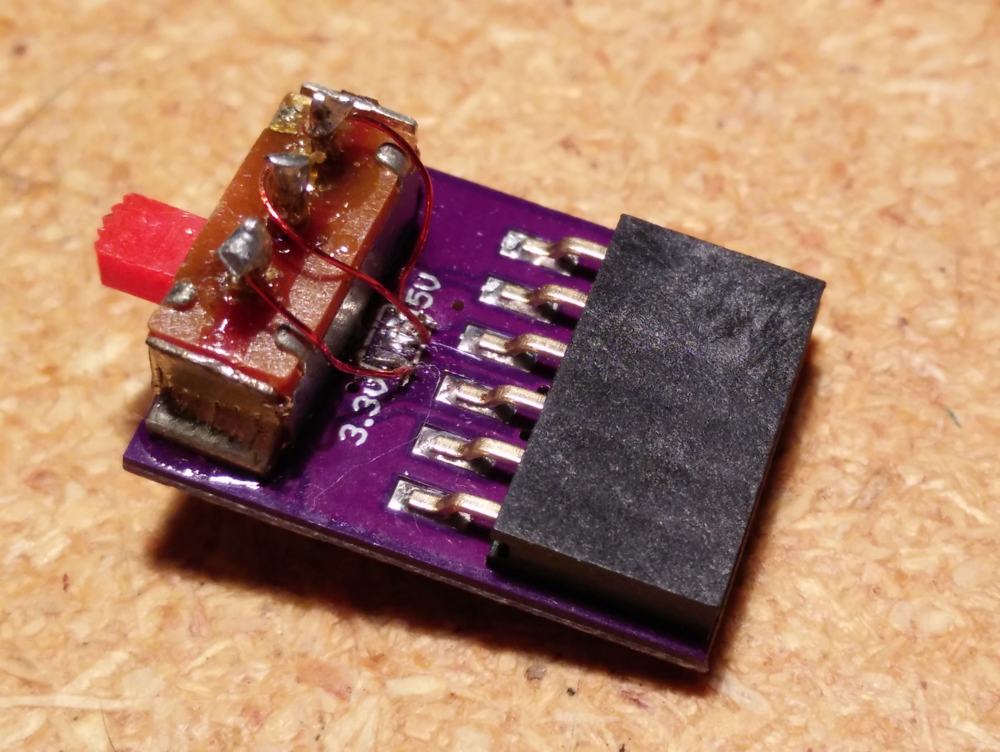
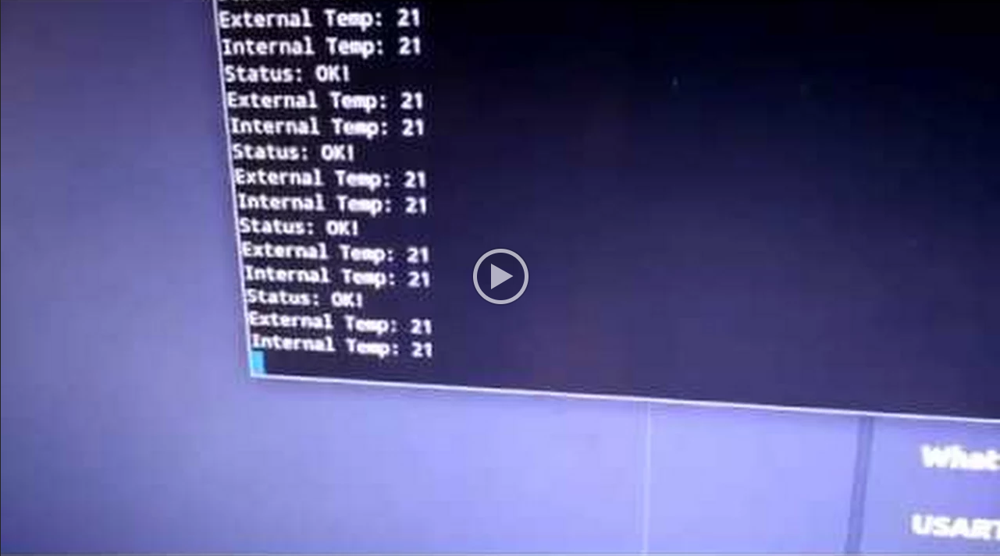

# Designing the Controller for a DIY Solder Reflow Oven

## Summary
In the last installment, we built the hardware to control an AC waveform with a TRIAC as the first step in a DIY solder reflow oven. This tutorial continues the project by showing you how to set up the low-level hardware to measure temperature, read the zero-cross detector, drive the TRIAC, and print to the serial terminal using a USART.

#### Technical Concepts
* C programming
* Serial peripheral interface
* USART
* Internal and external interrupts
* Timers / counters

#### Introduction
**[See Part 1: Control Your AC Mains with a Microcontroller ](http://www.allaboutcircuits.com/projects/controlling-ac-mains-with-a-microcontroller-for-fun-and-profit/)**

Last time we built the TRIAC driver and zero-cross detection circuitry to interface with 120VAC mains voltages. It's a very capable bit of circuitry but without a proper controller, the end result wasn't all that interesting since it could only turn on or off the waveform, and not dim it. In this project, we are  writing C code on an Atmel ATmega328P microcontroller to accomplish several key tasks:
1. Read zero-cross signal with external interrupt and drive TRIAC with a special form of pulse-width modulation
2. Use the _Universal Synchronous and Asynchronous serial Receiver and Transmitter_ (USART) to display debug data
3. Interface with MAX31855 thermocouple amplifier over the _Serial Peripheral Interface_ (SPI)
4. Create a general purpose millisecond timer to help facilitate timeouts, timestamps, and non-blocking delays

Bare metal C means that we are writing very low-level code -- C is just a single step up from assembly language as far as abstraction goes. This means we'll be manipulating bits in specific registers, specifying interrupt vectors directly in our interrupt service routines (ISRs), and sometimes dealing with raw memory allocation with `malloc()`. There are some macros that make this process a little easier for us (and make the code cleaner to read) but familiarity with some of the actual inner workings of the ATmega328P and the names it uses for different registers and components is very important. The [complete datasheet](http://www.atmel.com/images/Atmel-8271-8-bit-AVR-Microcontroller-ATmega48A-48PA-88A-88PA-168A-168PA-328-328P_datasheet_Complete.pdf)(PDF) for the chip has all that info in it and is worth keeping on hand. [Programming from the Gound Up](http://programminggroundup.blogspot.com/) may be a helpful resource as well for getting comfortable with low-level development.

_I borrowed some of my code from [Andy Brown](http://andybrown.me.uk/) and his [ATmega8 oven controller](https://github.com/andysworkshop/awreflow2/tree/master/atmega8l). There is some drop-in code reuse, some tweaked bits, and some totally different implementations. In addition to having a different controller, he wrote his code in C++ and uses a different build system but I still want to give him full credit for the previous work he's done._

#### What You Need for this Project
This project is mostly software so the parts count is relatively small. You'll need:
* 3.3V ATmega328P microcontroller board with crystal oscillator (necessary for propery USART functionality)
  * [Arduino Pro Mini (3.3V)](http://www.digikey.com/product-detail/en/DEV-11114/1568-1054-ND/5140819) - I got a Chinese knock-off from Ebay instead of DigiKey. There are a bunch of small variations between boards so be aware when connecting your pins.
  * [Built your own](https://www.arduino.cc/en/Tutorial/ArduinoToBreadboard) - Plenty of tutorials out there on breadboarding your chip and doing a true barebones solution
* In-circuit Serial Programmer (ICSP)
  * [AVR Dragon](http://www.atmel.com/tools/AVRDRAGON.aspx) - I use this one. Lots of features and relatively cheap
  * [Arduino Uno](https://www.arduino.cc/en/Tutorial/ArduinoToBreadboard) - Other main Arduino boards can be used as a programmer as well.
* USB-Serial Adapter
  * [FT232RL](https://www.sparkfun.com/products/10275) - **Needs to work at 3.3v!** I have this 5V model but I cut trace on the back and added a switch:


  * [CH340/CH341](http://www.seeedstudio.com/wiki/USB_To_Uart_5V/3V3)
* MAX31855 breakout
  * [Home grown](http://www.allaboutcircuits.com/projects/build-a-thermocouple-amplifier-and-custom-kicad-libraries/)
  * [Adafruit](http://www.adafruit.com/product/269)
* Functioning TRIAC AC controller
* Computer running Linux with `avrdude`, `binutils-avr`, `gcc-avr`, `avr-libc`, and `gdb-avr` installed. It's possible to do this on Windows or Mac but that is outside the scope of this project.

#### TRIAC Controller
This is the bread and butter of the controller. The `oven_control.c` file consist of several parts: an `oven_setup()`, `oven_setDutyCycle(percent)`, and the three ISRs to deal with different timing-critical events.  

**Oven Controller Initization Function**
```
void oven_setup(void)
{
    // Setup inputs and outputs
    CONFIG_AS_OUTPUT(TRIAC_EN);
    CONFIG_AS_INPUT(ZERO_CROSS);

    // Initial values for outputs
    SET_LOW(TRIAC_EN);

    // Configure external interrupt registers (Eventually move into macros.h)
    EICRA |= (1 << ISC01);      // Falling edge of INT0 generates an IRQ
    EIMSK |= (1 << INT0);       // Enable INT0 external interrupt mask

    // Enable Timer/Counter2 and trigger interrupts on both overflows & when
    // it equals OC2A    
    TIMSK2 |= (1 << OCIE2A) | (1 << TOIE2);
}
```

This function just sets up GPIO and interrupt conditions, as well as enabling TimerCounter2.

**Output Intensity Function**
```
void oven_setDutyCycle(uint8_t percent)
{

    uint16_t newCounter;

    // percentages between 1 and 99 inclusive use the lookup table to translate a linear
    // demand for power to a position on the phase angle axis
    if(percent > 0 && percent < 100)
        _percent = pgm_read_byte(&powerLUT[percent - 1]);

    // calculate the new counter value
    newCounter = ((TICKS_PER_HALF_CYCLE - MARGIN_TICKS - TRIAC_PULSE_TICKS) * (100 - percent)) / 100;

    // set the new state with interrupts off because 16-bit writes are not atomic
    cli();
    _counter_t2 = newCounter;
    _percent = percent;
    sei();
}
```

**Zero-Crossing Interrupt**
```
ISR(INT0_vect)
{
    /* 0 is an off switch. round up or down a percentage that strays into the
     * end-zone where we have a margin wide enough to cater for the minimum
     * pulse width and the delay in the zero crossing firing */
    if(_percent == 0)
    {
        OVEN_OFF();
        return;
    }
    // either user asked for 100 or calc rounds up to 100
    else if(_percent == 100 || _counter_t2 == 0)
    {
        OVEN_ON();
    }
    // Comparison to a constant is pretty fast
    else if(_counter_t2 > TICKS_PER_HALF_CYCLE - TRIAC_PULSE_TICKS - MARGIN_TICKS)
    {
        // Also a constant comparison so also pretty fast
        if(_counter_t2 > (TICKS_PER_HALF_CYCLE - (TRIAC_PULSE_TICKS - MARGIN_TICKS / 2)))
        {
            // round half up to completely off
            OVEN_OFF();
            return;
        }
        else
            _counter_t2 = TICKS_PER_HALF_CYCLE - TRIAC_PULSE_TICKS - MARGIN_TICKS;
    }

    // Counter is acceptable, or has been rounded down to be acceptable
    OCR2A = _counter_t2;
    TCNT2 = 0;
    TCCR2B = (1 << CS20) | (1 << CS21) | (1 << CS22);    // start timer: 8MHz/1024 = 128uS/tick
}
```

This triggers on the falling edge of pin PD2. Depending on what the global `_percent` variable is set to, it will either turn the oven full on, full off, or set the Timer/Counter2 "Output Compare Register A" to a value corresponding to the "off time" after zero-cross interrupt fires. It then clears Timer/Counter2 and starts the timer.

**Timer/Counter2 Comparison Interrupt**
```
ISR(TIMER2_COMPA_vect)
{
    // Turn on oven, hold it active for a min latching time before switching it off
    OVEN_ON();

    // The overflow interrupt will fire when the minimum pulse width is reached
    TCNT2 = 256 - TRIAC_PULSE_TICKS;
}
```

When the output comparison value is met, this interrupt is fired and it sets the TRIAC_ACTIVE pin high and loads up the TCNT2 register so that it overflows after TRIAC_PULSE_TICKS counts later.

**Timer/Counter2 Overflow Interrupt**
```
ISR(TIMER2_OVF_vect)
{
    // Turn off oven
    OVEN_OFF();

    // turn off the timer. the zero-crossing handler will restart it
    TCCR2B = 0;
}
```

When the timer overflows, the TRIAC_ACTIVE pin goes low and the timer turns off, waiting for an INT0_vect to repeat the process.

The `powerLUT[99]` array is used to map the linear percentage scale to a non-linear curve. With a linear scale, the actual power output change between 1% and 2% or 97% to 98% is significantly less than that at 50% to 51%. This is due to the sinusoidal nature of the quarter waveform we're dimming. This remapping lookup table helps to correct that -- see [Update 1: improving the phase angle timing](http://andybrown.me.uk/2015/07/12/awreflow2/) for more info. The PROGMEM attribute places the whole array into FLASH memory instead of RAM, saving space for the actual program. This will be useful for constant string storage as well later on in the series.

#### USART
In normal C or C++ programming on a computer, functions like `assert()` and `sprintf()` can print formatted text to the terminal and help with debugging. In order to communicate with our device, we need to implement some way of printing to a terminal. The easiest way of doing that is through serial communication with the ATmega's USART and a USB-serial converter.

**USART Initialization Function**
```
void usart_setup(uint32_t ubrr)
{
    // Set baud rate by loading high and low bytes of ubrr into UBRR0 register
    UBRR0H = (ubrr >> 8);
    UBRR0L = ubrr;

    // Turn on the transmission and reception circuitry
    UCSR0B = (1 << RXCIE0) | (1 << RXEN0 ) | (1 << TXEN0 );

    /* Set frame format: 8data, 2stop bit */
    UCSR0C = (1<<USBS0) | (3<<UCSZ00);

    // Use 8-N-1 -> Eight (8) data bits, No (N) partiy bits, one (1) stop bit
    // The initial vlaue of USCR0C is 0b00000110 which implements 8N1 by
    // Default. Setting these bits is for Paranoid Patricks and people that
    // Like to be reeeeeally sure that the hardware is doing what you say
    UCSR0C = (1 << UCSZ00) | (1 << UCSZ01);
}
```

In `usart.c`, there is the standard `usart_setup(uint32_t ubrr)` initialization function that enables the hardware and establishes the baud rate (bits/second) and transmission settings (8 data bits, no parity bits, 1 stop bit). This is hard-coded to 9600 baud for now in the `usart.h` file.

**Print Single Byte Function**
```
void usart_txb(const char data)
{
    // Wait for empty transmit buffer
    while (!(UCSR0A & (1 << UDRE0)));

    // Put data into buffer, sends the data
    UDR0 = data;
}
```

This function accepts a single byte and when the transmit buffer is empty, loads the byte into the buffer. This is the basis for the other printing functions.

**Printing Helper Functions**
```
/*** USART Print String Function ***/
void usart_print (const char *data)
{
    while (*data != '\0')
        usart_txb(*data++);
}
```
```
/*** USART Print String Function with New Line and Carriage Return ***/
void usart_println (const char *data)
{
    usart_print(data);
    usart_print("\n\r");    // GNU screen demands \r as well as \n :(
}
```

Much like Arduino's Serial.print() and Serial.println() functions, these take a string as an argument and for each character, calls the `usart_txb()` function. `usart_println()` just has an extra step to print a new line and a carriage return.

**Interrupt on Receive**
```
ISR(USART_RX_vect)
{
    unsigned char ReceivedByte;
    ReceivedByte = UDR0;
    UDR0 = ReceivedByte;
}
```

Right now there is no way to meaningfully interact with the software through the USART --  `ISR(USART_RX_vect)` was written as a placeholder for future development. When a character is received from the USB-serial converter, an interrupt is fired and it echos that same character to the output so it shows up on the screen.

#### General Purpose Timer
General delay and time comparison functions are very helpful in a lot of microcontroller applications. The `_delay()` function in `<avr/utils.h>` is helpful for small delays since it uses a while loop and `nop` instructions to do nothing for the specified amount of time. This prevents anything else from happening in the program, however. To deal with measuring longer blocks of time that allow for the program to continue, we use one of the free hardware timers and interrupts. On the ATmega328P, Timer/Counter0 is kind of gimpy and doesn't have as much functionality as Timer/Counter1 and Timer/Counter2 so it's a small triumph to be able to use it for something useful. We still have T/C1 but it would be nice to save it for something more complicated in the future.

**Timer Initization Function**
```
void msTimer_setup(void)
{
    // Leave everything alone in TCCR0A and just set the prescaler to Clk/8
    // in TCCR0B
    TCCR0B |= (1 << CS01);

    // Enable interrupt when Timer/Counter0 reaches max value and overflows
    TIMSK0 |= (1 << TOIE0);
}
```

The first function is of course the initialization function. It sets the prescaler to 1 MHz and enables the overflow interrupt.

**Return Current System Time Function**
```
uint32_t msTimer_millis(void)
{
    uint32_t ms;

    // NOTE: an 8-bit MCU cannot atomically read/write a 32-bit value so we
    // must disable interrupts while retrieving the value to avoid getting a
    // half-written value if an interrupt gets in while we're reading it
    cli();
    ms=_ms_counter;
    sei();

    return ms;
}
```

The msTimer functions chain together and all eventually call this function in some way. This simply returns the value of the global `_ms_counter` variable which is updated every millisecond.

**General Purpose Millisecond Delay Function**
```
void msTimer_delay(uint32_t waitfor)
{
    uint32_t target;

    target = msTimer_millis() + waitfor;
    while(_ms_counter < target);
}
```

This is the `delay()` utility function. It accepts as an argument the amount of milliseconds you'd like it to wait for and blocks with a `while()` loop until finished. This should still only be used for short delays.

**Time Difference Measurement Function**
```
uint32_t msTimer_deltaT(uint32_t start)
{
    // Return difference between a starting time and now, taking into account
    // wraparound
    uint32_t now = msTimer_millis();

    if(now > start)
        return now - start;
    else
        return now + (0xffffffff - start + 1);
}
```

Measures time delta between start time and current time. Can be used for delay loops that don't block. It also accounts for wraparound -- since time is saved in a 32-bit uint32_t variable, when it reaches 0xFFFFFFFF and increments, it rolls back around to zero. This factors that in to the calculation.

**Timeout Detection Function**
```
bool msTimer_hasTimedOut(uint32_t start,uint32_t timeout)
{
    // Check if a timeout has been exceeded. This is designed to cope with wrap
    // around
    return msTimer_deltaT(start) > timeout;
}
```

True or false flag thrown when checking if a certain amount of time has passed. This is used in the temperature sensor so that you can call the `read()` function at whatever speed you want but it will only update according to its timeout interval.

**Timer/Counter0 Overflow Interrupt**
```
ISR(TIMER0_OVF_vect)
{
    _ms_subCounter++;
    if((_ms_subCounter & 0x3) == 0) _ms_counter++;
    TCNT0 += 6;
}
```

The ISR running the show. Very accurately increments the global `_ms_counter` variable every millisecond.

#### Temperature Sensor
The functions and data structures used to interface with the MAX31855 are a little different than the previous ones. I'm using a pseudo-object oriented paradigm where there is a structure named max31855 which is defined in `max31855.h`:

```
typedef struct max31855
{
    int16_t     extTemp;        // 14-bit TC temp
    int16_t     intTemp;        // 12-bit internal temp
    uint8_t     status;         // Status flags
    uint32_t    lastTempTime;   // "Timestamp"
    uint32_t    pollInterval;   // Refresh rate of sensor
} max31855;
```

In `main.c`, a struct and a pointer to it are created and any time the temperature needs to be read or the values need to be printed to the USART, the struct pointer is passed as an argument to the different functions.

**Temperature Sensor "Object" Constructor**
```
max31855 *max31855_setup(void)
{
    // Reserve some space and make sure that it's not null
    max31855 *tempSense = malloc(sizeof(max31855));
    assert(tempSense != NULL);

    // Initilaize struct
    tempSense->extTemp = 0;
    tempSense->intTemp = 0;
    tempSense->status = UNKNOWN;
    // Not sure why Andy Brown makes his last temp time start at 0xFFFFD8EF but
    // it works... Maybe it's to test timer0 wrap around / guarantee causality:
    // https://github.com/andysworkshop/awreflow2/blob/master/atmega8l/TemperatureSensor.h
    tempSense->lastTempTime = 0xFFFFFFFF - 10000;
    tempSense->pollInterval = DEFAULT_POLL_INTERVAL;

    // Set GPIO direction
    CONFIG_AS_OUTPUT(MAX31855_CS);
    CONFIG_AS_OUTPUT(MAX31855_MOSI);
    CONFIG_AS_OUTPUT(MAX31855_SCK);
    CONFIG_AS_INPUT(MAX31855_MISO);

    // Enable pullup on ~CS
    PULLUP_ON(MAX31855_CS);

    // Set outputs to default values
    SET_HIGH(MAX31855_CS);
    SET_LOW(MAX31855_MOSI);
    SET_LOW(MAX31855_SCK);

    // Enable SPI, Master, set clock rate fosc/4 (already default but we're
    // Paranoid Patricks over here and also like to make our code clear!)
    SPCR = (1 << SPE) | (1 << MSTR);
    SPCR &= ~((1 << SPR1) | (1 << SPR0)); // Not necessary............

    // Super speed 2x SPI clock powerup!
    SPSR |= (1 << SPI2X);

    return tempSense;
}
```

This is the "constructor" and initialization function for the max31855 struct. It reserves space in memory using `malloc()` and makes sure that it's not NULL. Since there is no `sprintf()` built into the AVR libraries by default, if the condition is true, it just aborts the program by forcing it into an endless loop. It then configures GPIO and turns on the hardware SPI peripheral.

**Read and Update Temperature Sensor Function**
```
bool max31855_readTempDone(max31855 *tempSense)
{
    if(msTimer_hasTimedOut(tempSense->lastTempTime, tempSense->pollInterval))
    {
        uint8_t i;              // Loop index
        uint32_t rawBits = 0;   // Raw SPI bus bits

        // Bring ~CS low
        SET_LOW(MAX31855_CS);

        // clock 4 bytes from the SPI bus
        for(i = 0; i < 4; i++)
        {
            SPDR = 0;                           // start "transmitting" (actually just clocking)
            while(!(SPSR & (1 << SPIF)));       // wait until transfer ends

            rawBits <<= 8;                      // make space for the byte
            rawBits |= SPDR;                    // merge in the new byte
        }

        // restore CS high
        SET_HIGH(MAX31855_CS);

        // parse out the temp / error code from the raw bits. Are switch
        // statements bad? I dunno. Maybe. Who cares?
        uint8_t d = rawBits & 7;        // Are there any errors?
        if(!d)
        {
            tempSense->status = OK;
            // Only when tempterature is valid will it update temp. To get
            // Celcius integer, temp bits isolated with & bitmask, shifted
            // to right to align LSB (18 for extTemp, 4 for intTemp),
            // shifted to right again to get Celsius (extTemp = 0.25C per
            // bit >> 2; intTemp = 0.0625 C per bit >> 4)
            tempSense->extTemp = rawBits >> 20;
            tempSense->intTemp = (rawBits & 0x0000FFF0) >> 8;

            // Extend sign bit if negative value is read. In an oven. HA!
            if(tempSense->extTemp & 0x0800)
                tempSense->extTemp |= 0xF000;
            if(tempSense->intTemp & 0x0020)
                tempSense->intTemp |= 0xFFC0;
        }
        else
        {
            // Set temps to something obviously wrong
            tempSense->extTemp = -22222;
            tempSense->intTemp = -11111;

            // Which error code is it?
            switch(d)
            {
                case 1:
                    tempSense->status = OC_FAULT;
                    break;
                case 2:
                    tempSense->status = SCG_FAULT;
                    break;
                case 4:
                    tempSense->status = SCV_FAULT;
                    break;
                default:
                    tempSense->status = UNKNOWN;
                    break;
            }
        }

        // Update the timestamp and let the read loop unblock
        tempSense->lastTempTime = msTimer_millis();
        return true;
    }
    return false;
}
```

Designed to only refresh at the defined polling interval, this function leans heavily on the `msTimer_hasTimedOut()` function. If the timeout has been met, it clocks the SPI bus and reads in 32 bits of data. If the reading is valid and there aren't any error bits set, it parses out the temperature (both internal reference and external thermocouple) to the nearest integer. If there is an error, the temps are set to something obviously erroneous and the appropriate status flag is set.

**Status Message Helper Function**
```
const char *max31855_statusString(uint8_t status)
{
    switch(status)
    {
        case UNKNOWN:
            return "UNKNOWN";
        case OK:
            return "OK!";
        case SCV_FAULT:
            return "SCV_FAULT";
        case SCG_FAULT:
            return "SCG_FAULT";
        case OC_FAULT:
            return "OC_FAULT";
    }
    return "Err";
}
```

Based on the status code, return a string to be printed with USART.

**Temperature Sensor Printing Function**
```
void max31855_print(max31855 *tempSense)
{
    // max(int16_t) = "65535" + '\0'
    char buffer[6] = {0};

    usart_print("Status: ");
    usart_println(max31855_statusString(tempSense->status));

    usart_print("External Temp: ");
    usart_println(itoa(tempSense->extTemp, buffer, 10));

    usart_print("Internal Temp: ");
    usart_println(itoa(tempSense->intTemp, buffer, 10));
}
```

Convert the binary temperature value to decimal using the `itoa()` function and print using the USART.

#### Putting it All Together
The `main.c` file is just a small test file that initializes all the other parts through the `(device)_setup` command, flushes anything in the USART and then goes into an endless loop. In the loop, it fades the TRIAC drive intensity in and out and constantly tries to read the temperature. Since there's a poll interval specified in the `max31855_readTempDone()` function, it will only update and print status and temperature at that rate.

```
/*** main.c ***/

#include "globals.h"

int main(void)
{
    // Globally disable interrupts
    cli();

    // Setup oven, timers, USART, SPI
    oven_setup();
    msTimer_setup();
    usart_setup(BAUD_PRESCALE);

    // Something kinda like OOP in C
    max31855 *m = max31855_setup();

    // Flush USART buffer
    usart_flush();

    // Clear interrupt flag by reading the interrupt register
    // Specify that it's 'unused' so compiler doesn't complain
    uint8_t dummy __attribute__((unused)) = SPSR;
    dummy = SPDR;

    // Turn on global interrupt flag
    sei();

    // "Hello World" startup message
    usart_println("Hot Toaster Action");

    // Main program loop
    for(;;)
    {                
        // "Fade" duty cycle in and out with single for loop
        int i = 0;
        int dir = 1;
        for (i = 0; i > -1; i = i + dir)
        {
            // Control power output
            oven_setDutyCycle(i);

            // Switch direction at peak and pause for 10ms
            if (i == 100) dir = -1;
            msTimer_delay(10);

            // If it's done reading, print the temp and status
            if(max31855_readTempDone(m)) max31855_print(m);
        }
    }

    return 1;
}
```

To finally compile and upload the code to the board, we use _GNU Make_. Make allows you to specify compiler and programmer options with a somewhat cryptic syntax. I borrowed the makefile template from [Pat Deegan at electrons.psychogenic.com](http://electrons.psychogenic.com/modules/arms/view.php?w=art&idx=8&page=2) and modified it to suit my needs. You may need to do the same if your setup differs from mine at all. The main things you should be concerned with are:

```
# Name of target controller
# ...
MCU=atmega328p
```
```
# ID to use with programmer
# ...
PROGRAMMER_MCU=atmega328p
```
```
# Name of our project
# ...
PROJECTNAME=iot-reflow-oven
```
```
# programmer id
# ...
AVRDUDE_PROGRAMMERID=dragon_isp
```
```
# port
# ...
AVRDUDE_PORT=usb
```

Once everything is to your liking, type `make` to compile and `sudo make writeflash` to upload to your board. If everything went according to plan, it should look something like this:

[](https://drive.google.com/file/d/0B3jahN8xZtrpVVhKWXJoeHd2cU0/view)
