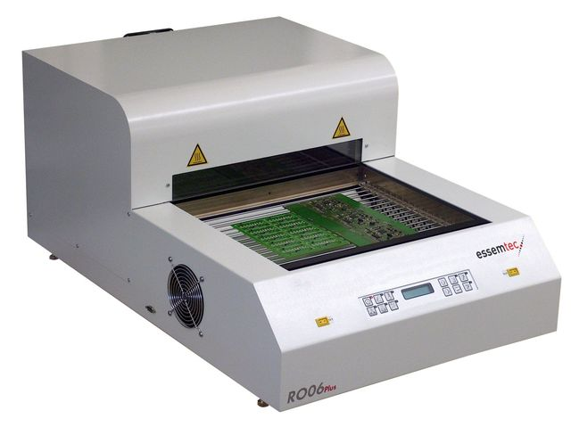
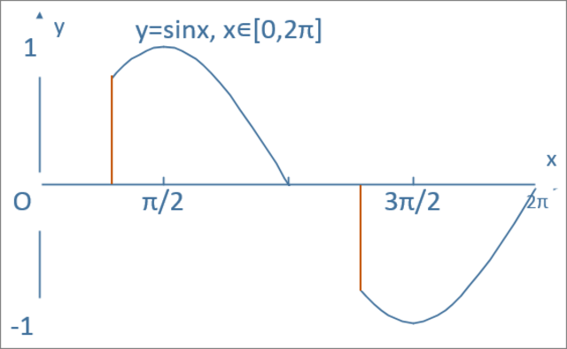
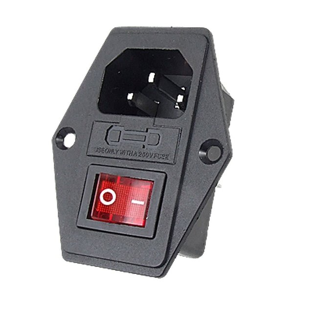
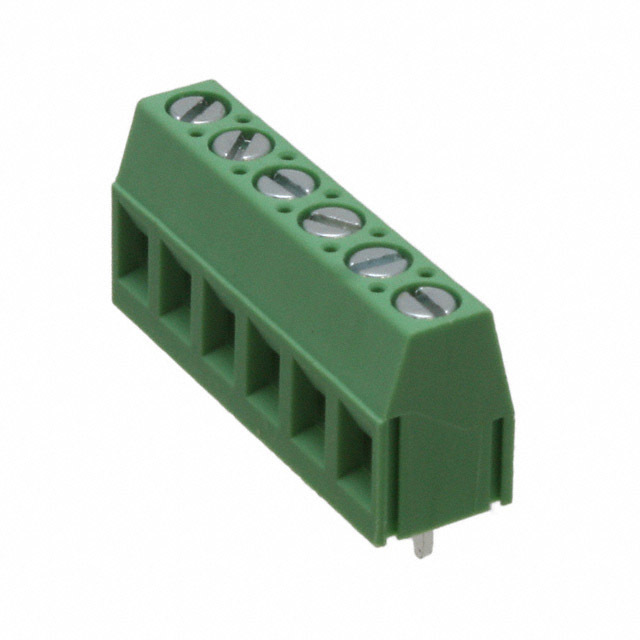
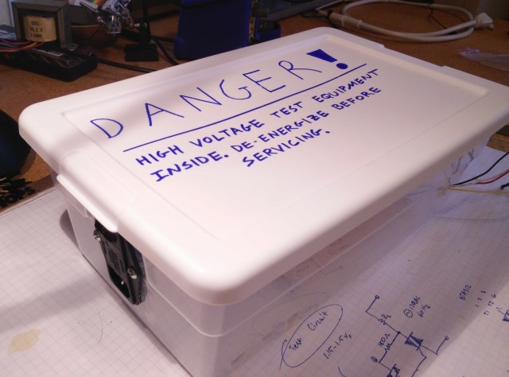
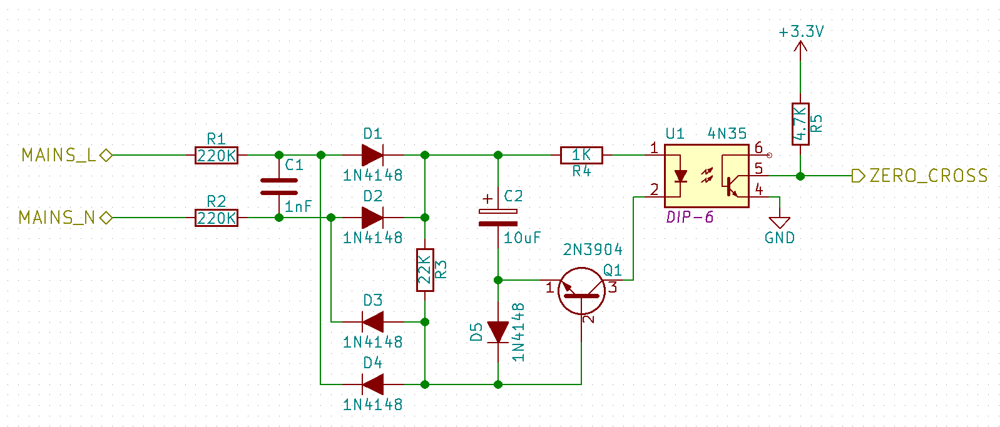

# Controlling AC Mains with a Microcontroller for Fun and Profit

## Summary
The first part of several on how to put together your own toaster oven controller with a handful of inexpensive, through-hole parts. The emphasis is on safety, low price, and minimal modification of the toaster oven.

## Technical Concepts
* High-voltage circuits
* TRIAC control
* Zero-crossing detectors
* Phase manipulation

## Introduction
The world is getting smaller and so are electronics designs. Through-hole components are less profitable for parts manufacturers and as a result, new products are often times only available in surface mount packages. Being able to solder surface mount parts by hand is a very valuable skill and can come in handy for parts like chip resistors and caps, small outline packages (SOIC/TSSOP), and quad flat packages (QFP). Still, what if the perfect ARM core for your quadcopter controller only comes as a quad-flat no-leads (QFN)? What if that FPGA you need to do vision processing with is only in a ball-grid array (BGA) style? You can take your chances with a hot air gun or you can use a solder reflow oven.

_Oooh shiny... But at what cost!?_

Solder reflow ovens are nothing new, nor is making one for yourself out of a standard toaster like this one. The issue is that commercial options are generally very expensive (the one above may cost upwards of $2000 USD) and many home-built options often require the dismantling and modding the toaster which can be error prone and require special tools (my own [Black & Decker Toasr-R-Oven](http://www.amazon.com/gp/product/B00FN3MV88/ref=pd_lpo_sbs_dp_ss_1?pf_rd_p=1944687742&pf_rd_s=lpo-top-stripe-1&pf_rd_t=201&pf_rd_i=B00164O3WU&pf_rd_m=ATVPDKIKX0DER&pf_rd_r=1JG8VGMESTPB12C5T56Z) has security Torx screws in it...). Sparkfun [published a tutorial](https://www.sparkfun.com/commerce/tutorial_info.php?tutorials_id=60) back in 2006, Andy Brown [created a beautiful design](http://andybrown.me.uk/2015/07/12/awreflow2/) on his blog, and even AAC author [Robert Keim](www.allaboutcircuits.com/author/robert-keim) has some tutorials on the basic concepts of oven controlling such as [zero-cross detection](http://www.allaboutcircuits.com/projects/ambient-light-monitor-zero-cross-detection/) and [controlling a TRIAC](http://www.allaboutcircuits.com/projects/ambient-light-monitor-using-a-triac-to-adjust-lamp-brightness/). This tutorial aims to flesh out some of the concepts and provide a different hardware and software approach to this application. It's another “recipe in the cookbook” if you will.

## A Few Notes on Safety

A rock climbing instructor jokingly told me once that there are three rules to heed when it comes to safety. In order of priority, they are:

1. Look good.

2. Don't die.

3. If you have to die, look good doing it.

I promise you that you will be in violation of all three if you don't respect how dangerous mains voltages can be. Hundreds of volts are nothing to sneeze at and can cause serious damage if you aren't careful. There are a few things to keep in mind when dealing with high voltages:

* Don't connect high voltages to a breadboard. The risk of wires coming loose or accidentally touching / plugging into the wrong hole on a breadboard is not worth it. Soldering components to perfboard should be OK for prototyping though.

* Absolutely hands off whenever mains are connected. If you have to measure high voltages with your multimeter, don't hold the probes to the board by hand; attach alligator clips and operate the device remotely. Better yet, use an incandescent bulb as a test load and remotely turned on the device with a surge protector switch.

* Above all else, be smart about this. If you don't know what you are doing or don't feel comfortable doing it, ask for help and find someone who does. The AAC forums and local hackerspaces are great resources to leverage.

## System-Level Design
A full oven controller consists of several parts:

_Toaster oven system flowchart_

It's worth mentioning that this is an ad-hoc AC dimmer in that it is designed to controlling __resistive loads only__, like most toaster ovens. Capacitive and inductive loads require some slight modifications (the addition of snubber components) which won't be covered here but information is available online and in the component datasheets. Compact fluorescent lamps (CFLs) have a fairly complicated electronic ballast circuit inside their housing that is not compatible with the AC dimmer at all.

A very common way of implementing an AC controller is with a solid-state relay. These allow the oven to be full ON or full OFF and the signal can be pulsed to get an approximate temperature (known colloquially as BANG-BANG controlling). A huge swath of the world's control systems run perfectly fine on BANG-BANG controllers but it is neither elegant nor super interesting to implement (in my opinion). Inside most solid state relays, however is a device called a TRIAC which can be ordered as a standalone device. Like Robert mentions [in his article](http://www.allaboutcircuits.com/projects/ambient-light-monitor-using-a-triac-to-adjust-lamp-brightness/), it's essentially a bidirectional extension of the thyristor, or can be though of as a solid-state switch that conducts current in both directions.

_The solid state relay. Bang-bang, baby!_

_Not as flashy as the SSR but our TRIAC does some super cool stuff_

The whole idea of this oven controller is to use the TRIAC to implement something known as AC  phase control. If you wait for the zero-crossing of the AC waveform and turn the TRIAC at and adjustable about of time later, you are left with an output waveform that retains the same frequency and magnitude of the original waveform for the time that the TRIAC is active. This limits the amount of power to the end device, effectively dimming it. Other methods of dimming exist like [wave packet control](https://de.wikipedia.org/wiki/Schwingungspaketsteuerung) (a sort of synchronous BANG-BANG paradigm; sorry no EN WikiPedia) but they are beyond the scope of this project.

_Example of AC phase control from [Andy's Workshop](andybrown.me.uk/wk/2015/07/12/awreflow2/)_

## Plugs, Terminals, and Enclosure

## Isolated Zero-Cross Detector
When controlling or measuring high voltage circuits with low voltage devices, it's best practice to galvanically isolate the two sides, either capacitively, inductively, or optically. Robert's TRIAC controller and zero-crossing detector use the transformer in a wall wart to step down the mains to a safer 12V – this is a common application of inductive isolation. This application uses optoisolators to separate the high and low voltages which have the advantage of being far lighter and more compact than bulky transformers. Optoisolators are slow compared to transformers and capacitor isolators but at sub-kilohertz speeds, it doesn't really matter. As a side note for completeness, capacitive isolation techniques are found often in high speed digital communication applications (ADCs, serial transceivers, etc).

My schematic looks like this:

and my perfboard circuit looks like this:

What's Going On
This circuit was lovingly borrowed from http://www.dextrel.net/diyzerocrosser.htm. The author does a fine job explaining the circuit in detail but a quick rundown goes like this (the part numbers I'm referring to are my schematic, not the author's): the two mains terminals are fed into the circuit on the far left. The waveform is then low-pass filtered and rectified before charging C2. The transistor, set up to act like a comparator, is off for the majority of the cycle except when the mains voltage divided by (R1 + R2) / R3 is lower than the voltage across C2. Current then conducts through the LED in the optoisolator , turning on the internal transistor. This pulls the output pin to ground. What's nice about this circuit is that it has an open collector on the output so it 'll leave the output pin floating when no zero cross is detected. Pull it up with a resistor to whatever voltage your microcontroller uses and Bob's your uncle!

I tested this circuit in isolation from the rest of the board with a modified power cable and a surge protector. The zero-crossing detector waveform superimposed on an AC sinusoid should look something like this:
[PIC]

## TRIAC Driver and Isolated Driver Circuit
Now that we have a signal leaving the AC dimmer box, it's time to send our own in. I mentioned earlier Andy Brown's tutorial. I adapted his TRIAC protection and driver circuit to work on 120VAC here in the States, and followed his thermal considerations for heatsink selection. The TRIAC we're using is the BTA312. We use another optoisolator to drive the TRIAC called the MOC310M which requires between 30 and 60mA to turn on. Most microcontrollers aren't comfortable sourcing this kind of current so we use a general purpose NPN transistor to provide it.

The schematic looks like this:
[PIC]

and the driver circuit looks like this:
[PIC]

The filter cap, the over-voltage varistor, the heatsink, and the screw terminals all live on a main board separate from the driver so that I could probe and test the low voltage components outside of the main board. That main board looks like this
[pic]

Putting everything together, you get this
[pic]

Connecting the stuff together, and putting 3.3V on the triac active line a light should turn on or whatever

## Next Steps
