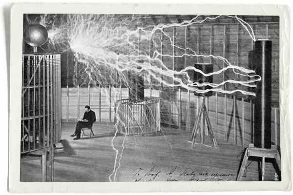

# Controlling AC Mains with a Microcontroller for Fun and Profit

## Summary
The first part of several on how to put together your own toaster oven controller with a handful of inexpensive, through-hole parts. The emphasis is on safety, low price, and minimal modification of the toaster oven.

## Technical Concepts
* High-voltage circuit considerations
* TRIAC control
* Zero-crossing detectors
* Phase manipulation

## Introduction
The world is getting smaller and so are electronics designs. Through-hole components are less profitable for parts manufacturers and as a result, new products are often times only available in surface mount packages. Being able to solder surface mount parts by hand is a very valuable skill and can come in handy for parts like chip resistors and caps, small outline packages (SOIC/TSSOP), and quad flat packages (QFP). Still, what if the perfect ARM core for your quadcopter controller only comes as a quad-flat no-leads (QFN)? What if that FPGA you need to do vision processing with is only in a ball-grid array (BGA) style? You can take your chances with a hot air gun or you can use a solder reflow oven.

_Oooh shiny... But at what cost!?_

Solder reflow ovens are nothing new, nor is making one for yourself out of a standard toaster like this one. The issue is that commercial options are generally very expensive (the one above may cost upwards of $2000 USD) and many home-built options often require the dismantling and modding the toaster which can be error prone and require special tools (my own [Black & Decker Toasr-R-Oven](http://www.amazon.com/gp/product/B00FN3MV88/ref=pd_lpo_sbs_dp_ss_1?pf_rd_p=1944687742&pf_rd_s=lpo-top-stripe-1&pf_rd_t=201&pf_rd_i=B00164O3WU&pf_rd_m=ATVPDKIKX0DER&pf_rd_r=1JG8VGMESTPB12C5T56Z) has security Torx screws in it...). Sparkfun [published a tutorial](https://www.sparkfun.com/commerce/tutorial_info.php?tutorials_id=60) back in 2006, Andy Brown [created a beautiful design](http://andybrown.me.uk/2015/07/12/awreflow2/) on his blog, and even AAC author [Robert Keim](www.allaboutcircuits.com/author/robert-keim) has some tutorials on the basic concepts of oven controlling such as [zero-cross detection](http://www.allaboutcircuits.com/projects/ambient-light-monitor-zero-cross-detection/) and [controlling a TRIAC](http://www.allaboutcircuits.com/projects/ambient-light-monitor-using-a-triac-to-adjust-lamp-brightness/). This tutorial aims to flesh out some of the concepts and provide a different hardware and software approach to this application. It's another “recipe in the cookbook” if you will. 

## A Few Notes on Safety
A climbing instructor jokingly told me once that there are three rules to heed when it comes to safety. In order of priority, they are:
1) Look good.
2) Don't die.
3) If you have to die, look good doing it.

I promise you that you will be in violation of all three if you don't respect how dangerous mains voltages can be. These are hundreds of volts and can cause serious damage if you aren't careful. There are a few things to keep in mind when dealing with high voltages:

* Don't connect high voltages to breadboard. Perfboard prototyping is OK but the risk of wires coming loose or accidentally touching / plugging into the wrong hole on a breadboard is not worth it.

* Absolutely hands off whenever mains are connected. If you have to measure high voltages with your multimeter, don't hold the probes to the board by hand; attach alligator clips and operate the device remotely. I used an incandescent bulb as a test load and remotely turned on the device with a surge protector switch.

* Above all else, be smart about this. If you don't know what you are doing or don't feel comfortable doing it, ask for help and find someone who does. The AAC forums and local hackerspaces are great resources to leverage.

## System-Level Design

## Isolated Zero-Cross Detector

## TRIAC Driver and Isolated Driver Circuit

## Next Steps
